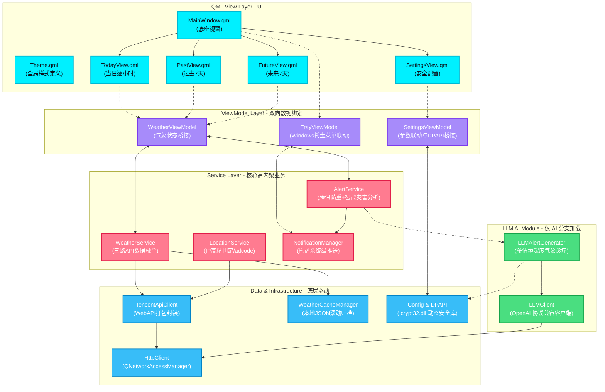

<p align="center">
  <picture>
    
  </picture>
</p>

<h1 align="center" style="font-size: 2.5em; font-weight: bold; margin-bottom: 0.2em; color: #00f0ff;">Nimbus</h1>

<p align="center">
  <strong>Windows 桌面高级智能天气驻留与提醒应用</strong>
</p>

<p align="center">
  
  
  
  
  
  
  
  
</p>

<p align="center" style="font-size: 1.1em; color: #cbd5e1; max-width: 750px; margin: 0 auto; line-height: 1.6;">
  🌌 <strong>Nimbus</strong> 是一款专为 Windows 用户设计的极具未来感的桌面天气应用。应用巧妙融合了<strong>深色赛博朋克玻璃态美学 (Glassmorphism)</strong> 与 <strong>LLM 智能气象洞察</strong>，以静默的系统托盘驻留形式运行，为用户提供极其精准的时间线温湿度变化、多时点弹性警报与腾讯官方+算法双重预警通知。
</p>

---

## 🌟 视觉预览

<table align="center" style="border-collapse: collapse; border: none; width: 100%; max-width: 1000px;">
  <tr style="border: none;">
    <td width="50%" align="center" style="border: none; padding: 12px; vertical-align: top;">
      <div style="border: 1px solid rgba(0,240,255,0.25); border-radius: 12px; padding: 6px; background: rgba(17,17,36,0.5); box-shadow: 0 8px 32px rgba(0,240,255,0.12);">
        
      </div>
      <br/><sub><b>当日 24 小时逐小时横向时间线</b><br/>当前时刻青色高亮，未来预测与当下温湿无缝滚动</sub>
    </td>
    <td width="50%" align="center" style="border: none; padding: 12px; vertical-align: top;">
      <div style="border: 1px solid rgba(0,240,255,0.25); border-radius: 12px; padding: 6px; background: rgba(17,17,36,0.5); box-shadow: 0 8px 32px rgba(0,240,255,0.12);">
        
      </div>
      <br/><sub><b>未来 7 天气象展望</b><br/>电光青高透玻璃态卡片，早晚温湿度风力全面追踪</sub>
    </td>
  </tr>
  <tr style="border: none;">
    <td width="50%" align="center" style="border: none; padding: 12px; vertical-align: top;">
      <div style="border: 1px solid rgba(255,123,144,0.25); border-radius: 12px; padding: 6px; background: rgba(17,17,36,0.5); box-shadow: 0 8px 32px rgba(255,123,144,0.12);">
        
      </div>
      <br/><sub><b>历史 7 天自动归档回溯</b><br/>日落珊瑚暖色主题卡片，基于本地逐小时自动归档，无流量损耗</sub>
    </td>
    <td width="50%" align="center" style="border: none; padding: 12px; vertical-align: top;">
      <div style="border: 1px solid rgba(0,240,255,0.25); border-radius: 12px; padding: 6px; background: rgba(17,17,36,0.5); box-shadow: 0 8px 32px rgba(0,240,255,0.12);">
        
      </div>
      <br/><sub><b>弹性定时天气监测提醒</b><br/>自定义时间点并配置“提前监测时长”，完美贴合您的通勤作息</sub>
    </td>
  </tr>
  <tr style="border: none;">
    <td width="50%" align="center" style="border: none; padding: 12px; vertical-align: top;">
      <div style="border: 1px solid rgba(255,255,255,0.1); border-radius: 12px; padding: 6px; background: rgba(17,17,36,0.5); box-shadow: 0 8px 32px rgba(255,255,255,0.05);">
        
      </div>
      <br/><sub><b>标准版（固定模板通知）</b><br/>极度轻量级，内置纯中文逻辑警报模板，无任何额外 API 开销</sub>
    </td>
    <td width="50%" align="center" style="border: none; padding: 12px; vertical-align: top;">
      <div style="border: 1px solid rgba(50,205,80,0.25); border-radius: 12px; padding: 6px; background: rgba(17,17,36,0.5); box-shadow: 0 8px 32px rgba(50,205,80,0.12);">
        
      </div>
      <br/><sub><b>AI 版（LLM 自然语言智脑）</b><br/>DeepSeek 智能气象诊断与穿衣出行建议，网络不佳自动模板降级</sub>
    </td>
  </tr>
</table>

---

## ✨ 核心特性

### 🎨 前卫视觉 UI/UX
- **深色赛博朋克美学**：全局深色渐变底板，搭配电光青（Electric Cyan）、日落珊瑚（Sunset Coral）与柔紫（Pastel Purple）对比色，展现高级的视觉层次感。
- **动态玻璃态卡片**：精心设计的毛玻璃卡片（Glassmorphism），支持流畅的悬停亮边微动画、顺滑过渡阻尼滚动。
- **屏幕无干扰驻留**：窗口尺寸精细锁死在屏幕 $\le 1/12$ 面积内，唤出位置固定贴靠在 Windows 任务栏通知区正上方，失去焦点自动淡出。

### ⚡ 精准气象观测与历史回溯
- **24小时滚动线**：当日天气逐小时横向顺滑滚动，当前小时高亮并跟随系统时间自动滑动。
- **未来与历史双全**：不仅拥有未来 7 天趋势观测，更内置基于本地 SQLite/JSON 的逐小时自动归档缓存，提供“过去 7 天”温暖珊瑚色历史天气卡片，断网亦可安心查阅。
- **adcode 市级精准定位**：支持基于 IP 地址的秒级高精定位，或从覆盖全国的 98 个核心城市列表中快速检索切换，底层完美归一化至中国标准市级区域编码。

### 🧠 双重预警机制与 LLM 智脑
- **腾讯官方灾害 + 逐小时自主智能监测**：内置双重警报融合算法。在拦截常规警报重复轰炸的基础上，通过自研算法实时预测降雨概率、极端温湿度，确保恶劣天气即时送达。
- **DeepSeek 智能气象诊断**（*仅 AI 版*）：在监测到预警时，DeepSeek 大模型会根据实时温度、温差、湿度及灾害类型，生成幽默、贴近生活的口语化穿衣与通勤提示。
- **高级降级安全网**：若遭遇 DeepSeek API 欠费、网络拥堵等意外，应用将在 $0.5\text{s}$ 内自动转入轻量级本地标准中文模板通知，确保警报绝对不漏报。

### 🛡️ Windows 底层深度安全集成
- **托盘常驻与自启动**：完备的系统托盘右键菜单支持，开机自启机制完全写入 Windows 注册表 `Run`，静默且无感。
- **Windows DPAPI 高级加密**：API 密钥及 LLM Token 均使用 Windows 核心 DPAPI（Data Protection API）加密算法进行存储。密钥与当前机器的 Windows 登录用户绑定，即使配置文件流出，在其他设备上也绝对无法解密，安全性极高。
- **WiX Toolset 高清 MSI 安装**：完整的自定义 MSI 打包工程，支持自定义安装路径、开机项自注册与完美卸载残留清理。

---

## 📦 版本对比与下载

Nimbus 采用 **单一代码库、双编译条件分支** 方案。针对纯粹天气需求和 AI 极客分别产出两个独立安装包。

| 特性 / 维度 | 🔘 Standard 标准版 | 🤖 AI 智能版 |
|:---|:---:|:---:|
| **CMake 编译参数** | `-DWITH_LLM=OFF` | `-DWITH_LLM=ON` |
| **通知逻辑** | 基于固定高可读中文模板 | DeepSeek 自然语言诊断 + API 离线自动模板降级 |
| **外部 API 依赖** | 仅腾讯位置服务 WebService API | 腾讯位置服务 API + DeepSeek (OpenAI 兼容) API |
| **安全存储** | DPAPI 加密存储腾讯开发密钥 | DPAPI 独立双密钥加密存储（腾讯键 + LLM 键） |
| **打包产物** | `Nimbus_Standard.msi` | `Nimbus_AI.msi` |
| **免安装包** | `Nimbus-v1.0.0-Standard.zip` | `Nimbus-v1.0.0-AI.zip` |

> [!NOTE]
> AI 版本在未启用 LLM 开关时，运行时开销及底层依赖与标准版完全一致，不会带来多余的性能损耗。

👉 **[前往 GitHub Releases 下载最新生产版本](https://github.com/shimamuraDS/Nimbus/releases)**

---

## 🛠️ 技术栈剖析

Nimbus 坚持使用轻量级的高性能架构，保证冷启动在 $100\text{ms}$ 内完成，且常驻内存控制在 $35\text{MB}$ 左右。

```
┌─────────────────────────────────────────────────────┐
│                    QML View Layer                     │
│   MainWindow · TodayView · PastView · FutureView     │
│   SettingsView · 11 可复用组件 (Theme, Cards, etc.)    │
├─────────────────────────────────────────────────────┤
│                ViewModel Layer (C++)                  │
│   WeatherViewModel · SettingsViewModel · TrayVM      │
├─────────────────────────────────────────────────────┤
│                  Service Layer                        │
│   Weather · Location · Alert · Notification          │
├───────────────────┬─────────────────────────────────┤
│   Network Layer    │        Data / Util Layer         │
│   Tencent LBS API  │  Cache Manager · DPAPI · Config  │
│   (3 weather APIs) │  TimeUtil · WeatherCode · Screen │
├───────────────────┴─────────────────────────────────┤
│               LLM Module (AI build only)              │
│        LLMClient (OpenAI compat) · LLMAlertGenerator  │
└─────────────────────────────────────────────────────┘
```

| 架构层级 | 技术选型 | 功能说明 |
|:---|:---|:---|
| **开发语言** | C++17 · QML (Qt Quick) | 原生执行效率 + 极富动感的 GPU 加速声明式 UI |
| **核心框架** | Qt 6.8 LTS | 选用 Core / Gui / Qml / Quick / Network / Widgets 最优原生模块 |
| **构筑系统** | CMake 3.16+ · Ninja | 现代化 C++ 构建树，配合 Ninja 获得秒级极速编译体验 |
| **设计模式** | MVVM + 三层服务化架构 | UI 数据双向绑定，View 零业务逻辑，逻辑层高度单元可测 |
| **外部服务** | 腾讯位置 API + OpenAI SDK 兼容网络层 | 提供全国 IP 定位、高精预警、实时/逐小时/多日天气 |
| **加密安全** | Windows DPAPI (动态加载) | 动态软加载 `crypt32.dll`，免去静态依赖，跨 Windows 发行版零冲突 |
| **分发安装** | WiX Toolset v7 | 工业级 Windows 安装包标准，带来纯净的安装/升级/卸载交互 |
| **自动化测试** | QtTest + CTest | 覆盖时效合并算法、多路警报判定与 HTTP 异步重试器单元测试 |

---

## 🏗️ 架构拓扑关系

通过下图可以直观理解 **Nimbus** 中 QML UI 层、C++ ViewModel、核心 Service 逻辑以及底层 Network / Data 驱动的流动路径：



---

## 🚀 快速上手与编译指南

### 1. 环境准备

要顺利完成编译，您的 Windows 系统中必须具备以下组件：

* **Qt SDK**：Qt 6.8+ (推荐使用 MinGW 64-bit 构建套件)
* **CMake**：v3.16 及以上
* **Ninja**：推荐作为 CMake Generator 以获得飞速的增量编译体验
* **WiX Toolset**：v7+（若不需要打包安装包，此项为可选）

### 2. 获取代码与编译

打开 PowerShell 或 MSYS2 终端，克隆并执行编译：

```bash
git clone https://github.com/shimamuraDS/Nimbus.git
cd Nimbus

# ----------------- 方案 A: 编译标准版 -----------------
# 1. 配置标准版编译参数 (禁用 LLM 分支)
cmake -G "Ninja" -DWITH_LLM=OFF -DCMAKE_BUILD_TYPE=Release -B build-standard
# 2. 执行编译
cmake --build build-standard --config Release

# ----------------- 方案 B: 编译 AI 智能版 -----------------
# 1. 配置 AI 版编译参数 (启用 LLM 强编译参数)
cmake -G "Ninja" -DWITH_LLM=ON -DCMAKE_BUILD_TYPE=Release -B build-ai
# 2. 执行编译
cmake --build build-ai --config Release
```

### 3. 运行自动化测试

Nimbus 拥有严苛的自动化测试用例，您可以通过 CTest 运行这些单元测试：

```bash
# 进入标准版编译输出目录并运行测试
ctest --test-dir build-standard --output-on-failure
```

---

## 📦 部署与 WiX MSI 打包流程

### 1. 抽取 Qt 运行时依赖 (windeployqt)
在生成独立包前，首先需要拷贝 Qt 的运行动态链接库与 QML 模块：

```bash
# 假定编译生成的 Nimbus.exe 位于 deploy/standard 目录
windeployqt --qmldir ./qml --release deploy/standard/Nimbus.exe
```

### 2. 使用 WiX Toolset 构建高清 Windows 安装程序
应用提供了专用的打包生成器脚本，能自动分析依赖目录并生成对应的 Wix 文件，最后编译为极具质感的 `.msi` 格式安装包：

```powershell
# 1. 通过 Python 自动化脚本扫描并生成 WXS 定义文件
python scripts/generate_wxs.py deploy/standard scripts/Nimbus_Standard.wxs --name "Nimbus Standard" --upgrade-code "<您的唯一样式GUID>"

# 2. 添加 WiX 的 UI 拓展库 (支持 MSI 自定义路径向导)
wix extension add WixToolset.UI.wixext

# 3. 编译并输出标准的 MSI 包
wix build -ext WixToolset.UI.wixext -o scripts/Installer/Nimbus_Standard.msi scripts/Nimbus_Standard.wxs
```

---

## 💻 开发者代码展示

下面是 Nimbus 中最令开发者惊艳的两段核心代码片段，点击展开即可预览其精湛的设计：

<details>
<summary><b>1. 全局 Cyberpunk 玻璃态主题配置 (Theme.qml)</b></summary>

```qml
import QtQuick

QtObject {
    // ── 赛博朋克深色色板 (毛玻璃效果支持) ──
    property color windowGradientTop: "#111124"
    property color windowGradientBottom: "#06060c"
    
    // 毛玻璃卡片背景及微光边框颜色
    property color cardBg: "#0affffff"
    property color cardBgHover: "#18ffffff"
    property color cardBorder: "#12ffffff"
    property color cardBorderHover: "#28ffffff"
    
    // 醒目强调对比色 (电光青 / 暖珊瑚 / 柔紫)
    property color accent: "#00f0ff"          // Electric Cyan
    property color accentWarm: "#ff7b90"      // Sunset Coral
    property color accentSecondary: "#a78bfa"   // Pastel Purple
    
    // 荧光辉光投影效果颜色值
    property color glowCyan: "#3000f0ff"
    property color glowCoral: "#30ff7b90"
    
    // 现代黑体文字系统
    property string defaultFamily: "Microsoft YaHei"
    property font titleFont: Qt.font({ family: defaultFamily, pointSize: 18, weight: Font.Bold })
    property font subtitleFont: Qt.font({ family: defaultFamily, pointSize: 13, weight: Font.DemiBold })
    property font bodyFont: Qt.font({ family: defaultFamily, pointSize: 11, weight: Font.Normal })
}
```
</details>

<details>
<summary><b>2. Windows DPAPI 安全动态载入核心 (Config.cpp)</b></summary>

```cpp
#include <windows.h>
#include <wincrypt.h>

// 巧妙通过 Windows Runtime 动态载入 crypt32.dll，彻底斩断静态链接产生的符号冲突
static bool initDPAPI(DATA_BLOB& out, const DATA_BLOB& in, bool protect, LPCWSTR entropy) {
    HMODULE hLib = LoadLibraryW(L"crypt32.dll");
    if (!hLib) return false;

    using ProtectFunc = BOOL (WINAPI *)(DATA_BLOB*, LPCWSTR, DATA_BLOB*, PVOID,
                                        CRYPTPROTECT_PROMPTSTRUCT*, DWORD, DATA_BLOB*);
    using UnprotectFunc = BOOL (WINAPI *)(DATA_BLOB*, LPWSTR*, DATA_BLOB*, PVOID,
                                          CRYPTPROTECT_PROMPTSTRUCT*, DWORD, DATA_BLOB*);

    bool ok = false;
    if (protect) {
        auto fn = (ProtectFunc)GetProcAddress(hLib, "CryptProtectData");
        if (fn) ok = fn(const_cast<DATA_BLOB*>(&in), entropy, nullptr,
                        nullptr, nullptr, CRYPTPROTECT_UI_FORBIDDEN, &out);
    } else {
        auto fn = (UnprotectFunc)GetProcAddress(hLib, "CryptUnprotectData");
        if (fn) ok = fn(const_cast<DATA_BLOB*>(&in), nullptr, nullptr, nullptr,
                        nullptr, CRYPTPROTECT_UI_FORBIDDEN, &out);
    }
    FreeLibrary(hLib);
    return ok && out.pbData;
}
```
</details>

---

## ❓ 常见问题与排坑指南

> [!WARNING]
> **Windows 环境编译缺少 `crypt32` 链接库报错？**
> Nimbus 的 C++ 代码已全面采用 `LoadLibrary` 动态软载入方案，**请勿**手动在 CMake 中加入对 `crypt32` 库的静态关联，否则可能在低版本 Windows 上引发不可预知的二进制损坏。

> [!TIP]
> **如何为应用添加更多手动定位的中国城市？**
> 只需在 `src/util/WeatherCode.h` 中追加所需的城市 adcode 与中文名称对照，重新编译后 UI 的城市选择菜单即可自动渲染。

> [!CAUTION]
> **大模型返回天气提示异常空泛？**
> 请确保在设置页中填入了正确的 API Base URL（例如：`https://api.deepseek.com`）与完整无误的 API KEY，且 API KEY 的解密状态可以在 **API设置** 界面一键点击“测试连接”进行状态联通确认。

---

## 📄 开源许可证

本项目基于 [MIT 许可证](LICENSE) 许可开源。您可自由用于学习、二次改造与商业分发。

---
<p align="center">
  Designed with ❤️ by <b>Nimbus Team</b>. Welcome to submit Issues & Pull Requests!
</p>
