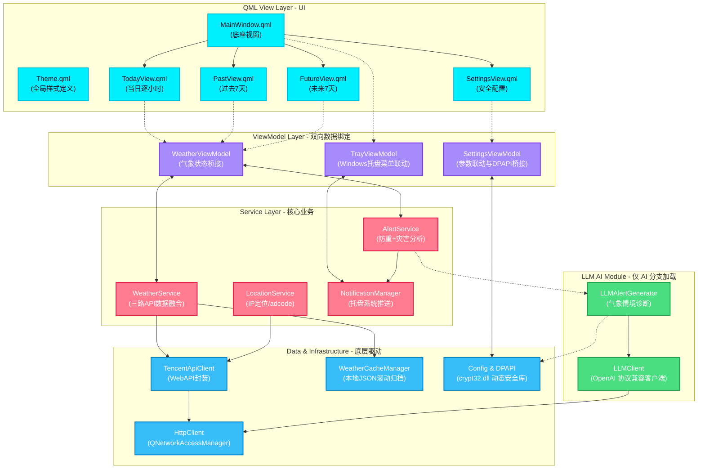

<p align="center">
  
</p>

<h1 align="center" style="font-size: 2.5em; font-weight: bold; margin-bottom: 0.2em; color: #00f0ff;">Nimbus</h1>

<p align="center">
  <strong>Windows 桌面天气提醒应用</strong>
</p>

<p align="center">
  
  
  
  
  
  
  
  
</p>

<p align="center" style="font-size: 1.1em; color: #cbd5e1; max-width: 750px; margin: 0 auto; line-height: 1.6;">
  Nimbus 是一款 Windows 桌面天气应用，采用深色赛博朋克玻璃态 (Glassmorphism) 风格，支持 LLM 智能通知。应用以系统托盘驻留形式运行，提供逐小时时间线、多时点弹性警报与双重预警功能。
</p>

---

## 截图预览

<table align="center" style="border-collapse: collapse; border: none; width: 100%; max-width: 1000px;">
  <tr style="border: none;">
    <td width="50%" align="center" style="border: none; padding: 12px; vertical-align: top;">
      <div style="border: 1px solid rgba(0,240,255,0.25); border-radius: 12px; padding: 6px; background: rgba(17,17,36,0.5); box-shadow: 0 8px 32px rgba(0,240,255,0.12);">
        
      </div>
      <br/><sub><b>当日 24 小时逐小时时间线</b><br/>当前时刻青色高亮，未来预测与历史数据横向滚动</sub>
    </td>
    <td width="50%" align="center" style="border: none; padding: 12px; vertical-align: top;">
      <div style="border: 1px solid rgba(0,240,255,0.25); border-radius: 12px; padding: 6px; background: rgba(17,17,36,0.5); box-shadow: 0 8px 32px rgba(0,240,255,0.12);">
        
      </div>
      <br/><sub><b>未来 7 天气象展望</b><br/>电光青玻璃态卡片，展示早晚温湿度及风力信息</sub>
    </td>
  </tr>
  <tr style="border: none;">
    <td width="50%" align="center" style="border: none; padding: 12px; vertical-align: top;">
      <div style="border: 1px solid rgba(255,123,144,0.25); border-radius: 12px; padding: 6px; background: rgba(17,17,36,0.5); box-shadow: 0 8px 32px rgba(255,123,144,0.12);">
        
      </div>
      <br/><sub><b>历史 7 天自动归档回溯</b><br/>日落珊瑚暖色主题，基于本地逐小时缓存自动归档</sub>
    </td>
    <td width="50%" align="center" style="border: none; padding: 12px; vertical-align: top;">
      <div style="border: 1px solid rgba(0,240,255,0.25); border-radius: 12px; padding: 6px; background: rgba(17,17,36,0.5); box-shadow: 0 8px 32px rgba(0,240,255,0.12);">
        
      </div>
      <br/><sub><b>定时天气监测提醒</b><br/>自定义时间点与提前监测时长，支持修改与删除</sub>
    </td>
  </tr>
  <tr style="border: none;">
    <td width="50%" align="center" style="border: none; padding: 12px; vertical-align: top;">
      <div style="border: 1px solid rgba(255,255,255,0.1); border-radius: 12px; padding: 6px; background: rgba(17,17,36,0.5); box-shadow: 0 8px 32px rgba(255,255,255,0.05);">
        
      </div>
      <br/><sub><b>标准版（固定模板通知）</b><br/>内置中文逻辑警报模板，无额外 API 开销</sub>
    </td>
    <td width="50%" align="center" style="border: none; padding: 12px; vertical-align: top;">
      <div style="border: 1px solid rgba(50,205,80,0.25); border-radius: 12px; padding: 6px; background: rgba(17,17,36,0.5); box-shadow: 0 8px 32px rgba(50,205,80,0.12);">
        
      </div>
      <br/><sub><b>AI 版（LLM 自然语言通知）</b><br/>DeepSeek 气象诊断与穿衣出行建议，网络不佳时自动模板降级</sub>
    </td>
  </tr>
</table>

---

## 核心特性

### UI/UX
- **深色赛博朋克风格**：全局深色渐变底板，搭配电光青 (Electric Cyan)、日落珊瑚 (Sunset Coral) 与柔紫 (Pastel Purple) 三套对比色。
- **玻璃态卡片**：毛玻璃卡片 (Glassmorphism)，支持悬停亮边微动画与顺滑阻尼滚动。
- **屏幕驻留设计**：窗口尺寸限制在屏幕 1/12 面积内，唤出位置固定于任务栏通知区上方，失去焦点自动隐藏。

### 气象观测与历史回溯
- **24 小时时间线**：当日天气逐小时横向滚动，当前小时高亮并跟随系统时间自动滑动。
- **未来与历史双覆盖**：未来 7 天趋势预报 + 过去 7 天历史天气卡片，基于本地 JSON 逐小时缓存归档，断网可查。
- **adcode 市级定位**：支持 IP 自动定位，或从覆盖全国的 98 个城市列表中手动选择，底层归一化至市级区域编码。

### 双重预警与 LLM
- **腾讯官方灾害 + 逐小时智能监测**：双重警报融合算法，避免重复通知，同时实时预测降雨概率与极端温湿度。
- **DeepSeek 气象诊断**（仅 AI 版）：监测到预警时，DeepSeek 大模型根据实时温湿度及灾害类型生成口语化穿衣与通勤提示。
- **降级机制**：DeepSeek API 不可用时自动转入本地标准中文模板通知，确保警报不遗漏。

### 安全集成
- **托盘常驻与自启动**：系统托盘右键菜单，开机自启写入 Windows 注册表 `Run`。
- **Windows DPAPI 加密**：API 密钥及 LLM Token 使用 Windows DPAPI 加密存储，密钥与当前用户绑定，配置文件流出后无法在其他设备解密。
- **WiX MSI 安装**：支持自定义安装路径、开机项注册与卸载清理。

---

## 版本对比与下载

Nimbus 采用单一代码库、双编译条件分支方案，产出两个独立安装包。

| 维度 | Standard 标准版 | AI 智能版 |
|:---|:---:|:---:|
| **CMake 编译参数** | `-DWITH_LLM=OFF` | `-DWITH_LLM=ON` |
| **通知逻辑** | 固定中文模板 | DeepSeek 自然语言 + API 离线自动模板降级 |
| **外部 API 依赖** | 仅腾讯位置服务 WebService API | 腾讯位置服务 API + DeepSeek (OpenAI 兼容) API |
| **安全存储** | DPAPI 加密存储腾讯开发密钥 | DPAPI 双密钥加密（腾讯键 + LLM 键） |
| **打包产物** | `Nimbus_Standard.msi` | `Nimbus_AI.msi` |
| **免安装包** | `Nimbus-v1.0.0-Standard.zip` | `Nimbus-v1.0.0-AI.zip` |

> [!NOTE]
> AI 版本在未启用 LLM 开关时，运行时开销及底层依赖与标准版一致。

[前往 GitHub Releases 下载最新版本](https://github.com/shimamuraDS/Nimbus/releases)

---

## 技术栈

```
┌─────────────────────────────────────────────────────┐
│                    QML View Layer                     │
│   MainWindow · TodayView · PastView · FutureView     │
│   SettingsView · 11 可复用组件 (Theme, Cards, etc.)    │
├─────────────────────────────────────────────────────┤
│                ViewModel Layer (C++)                  │
│   WeatherViewModel · SettingsViewModel · TrayVM      │
├─────────────────────────────────────────────────────┤
│                  Service Layer                        │
│   Weather · Location · Alert · Notification          │
├───────────────────┬─────────────────────────────────┤
│   Network Layer    │        Data / Util Layer         │
│   Tencent LBS API  │  Cache Manager · DPAPI · Config  │
│   (3 weather APIs) │  TimeUtil · WeatherCode · Screen │
├───────────────────┴─────────────────────────────────┤
│               LLM Module (AI build only)              │
│        LLMClient (OpenAI compat) · LLMAlertGenerator  │
└─────────────────────────────────────────────────────┘
```

| 架构层级 | 技术选型 | 说明 |
|:---|:---|:---|
| **开发语言** | C++17 · QML (Qt Quick) | 原生执行效率 + GPU 加速声明式 UI |
| **核心框架** | Qt 6.8 LTS | Core / Gui / Qml / Quick / Network / Widgets |
| **构建系统** | CMake 3.16+ · Ninja | 现代化 C++ 构建，Ninja 增量编译 |
| **设计模式** | MVVM + 三层服务化架构 | UI 数据双向绑定，View 零业务逻辑 |
| **外部服务** | 腾讯位置 API + OpenAI SDK 兼容网络层 | IP 定位、天气预警、实时/逐小时/多日天气 |
| **加密安全** | Windows DPAPI (动态加载 crypt32.dll) | 免静态依赖，跨 Windows 发行版兼容 |
| **分发安装** | WiX Toolset v7 | Windows 安装包标准，支持安装/升级/卸载 |
| **自动化测试** | QtTest + CTest | 覆盖时效合并、多路警报判定与 HTTP 异步重试 |

---

## 架构关系



---

## 编译指南

### 1. 环境要求

* **Qt SDK**：Qt 6.8+ (MinGW 64-bit 构建套件)
* **CMake**：v3.16 及以上
* **Ninja**：推荐作为 CMake Generator
* **WiX Toolset**：v7+（仅打包需要）

### 2. 编译

```bash
git clone https://github.com/shimamuraDS/Nimbus.git
cd Nimbus

# 标准版 (禁用 LLM)
cmake -G "Ninja" -DWITH_LLM=OFF -DCMAKE_BUILD_TYPE=Release -B build-standard
cmake --build build-standard --config Release

# AI 版 (启用 LLM)
cmake -G "Ninja" -DWITH_LLM=ON -DCMAKE_BUILD_TYPE=Release -B build-ai
cmake --build build-ai --config Release
```

### 3. 测试

```bash
ctest --test-dir build-standard --output-on-failure
```

---

## WiX MSI 打包

### 1. 部署 Qt 运行时

```bash
windeployqt --qmldir ./qml --release deploy/standard/Nimbus.exe
```

### 2. 构建 MSI

```powershell
# 生成 WXS 定义文件
python scripts/generate_wxs.py deploy/standard scripts/Nimbus_Standard.wxs --name "Nimbus Standard" --upgrade-code "<YOUR_GUID>"

# 添加 UI 拓展库
wix extension add WixToolset.UI.wixext

# 编译 MSI 包
wix build -ext WixToolset.UI.wixext -o scripts/Installer/Nimbus_Standard.msi scripts/Nimbus_Standard.wxs
```

---

## 常见问题

> [!WARNING]
> **编译缺少 `crypt32` 链接库？**
> Nimbus 已采用 `LoadLibrary` 动态载入方案，请勿在 CMake 中静态链接 `crypt32`，否则可能在低版本 Windows 上引发兼容性问题。

> [!TIP]
> **如何添加更多手动定位城市？**
> 在 `src/util/WeatherCode.h` 中追加城市 adcode 与中文名称对照，重新编译后 UI 城市选择菜单即自动更新。

> [!CAUTION]
> **LLM 返回天气提示异常？**
> 请确保在设置页中填入正确的 API Base URL（如 `https://api.deepseek.com`）与有效的 API KEY，可在 API 设置界面点击"测试连接"确认连通状态。

---

## 开源许可证

本项目基于 [MIT 许可证](LICENSE) 开源。

---
<p align="center">
  by <b>shimamuraDS</b>
</p>
