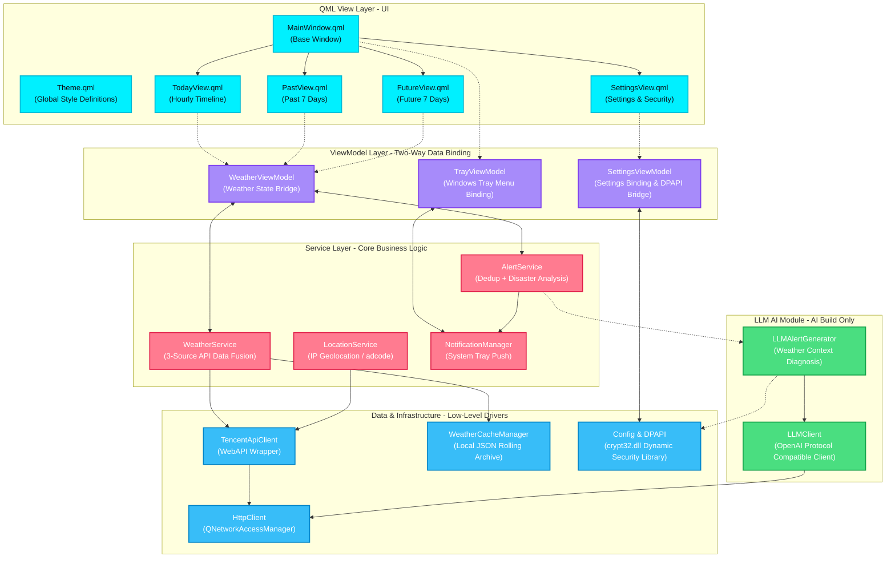
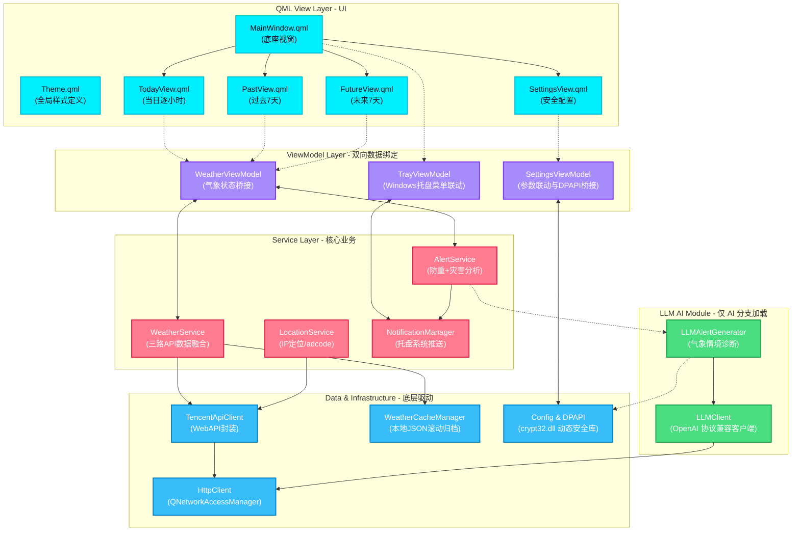
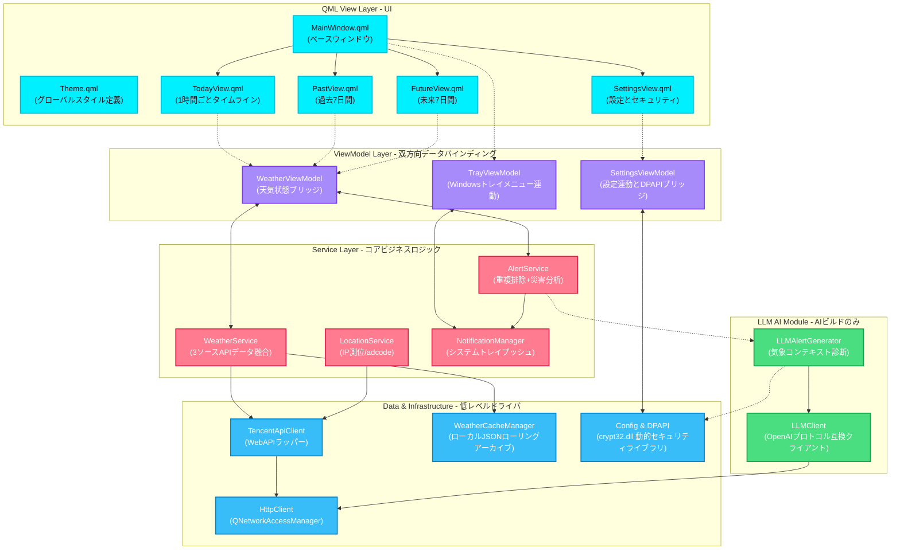

<p align="center">
  
</p>

<h1 align="center" style="font-size: 2.5em; font-weight: bold; margin-bottom: 0.2em; color: #00f0ff;">Nimbus</h1>

<p align="center">
  <strong>Windows Desktop Weather Alert App</strong><br/>
  <sub>Windows 桌面天气提醒应用</sub><br/>
  <sub>Windows デスクトップ天気アラートアプリ</sub>
</p>

<p align="center">
  <b>
    <a href="#english">English</a> |
    <a href="#chinese">中文</a> |
    <a href="#japanese">日本語</a>
  </b>
</p>

<p align="center">
  
  
  
  
  
  
  
  
</p>

---

<a id="english"></a>

## English

<p align="center" style="font-size: 1.1em; color: #cbd5e1; max-width: 750px; margin: 0 auto; line-height: 1.6;">
  Nimbus is a Windows desktop weather app with a dark cyberpunk Glassmorphism UI and LLM-powered intelligent notifications. It runs as a system tray resident, delivering an hourly timeline, flexible multi-point alerts, and a dual-warning system combining official disaster warnings with smart hourly monitoring.
</p>

---

### Screenshots

<table align="center" style="border-collapse: collapse; border: none; width: 100%; max-width: 1000px;">
  <tr style="border: none;">
    <td width="50%" align="center" style="border: none; padding: 12px; vertical-align: top;">
      <div style="border: 1px solid rgba(0,240,255,0.25); border-radius: 12px; padding: 6px; background: rgba(17,17,36,0.5); box-shadow: 0 8px 32px rgba(0,240,255,0.12);">
        
      </div>
      <br/><sub><b>24-Hour Hourly Timeline</b><br/>Current hour highlighted in cyan; future forecasts and historical data scroll horizontally</sub>
    </td>
    <td width="50%" align="center" style="border: none; padding: 12px; vertical-align: top;">
      <div style="border: 1px solid rgba(0,240,255,0.25); border-radius: 12px; padding: 6px; background: rgba(17,17,36,0.5); box-shadow: 0 8px 32px rgba(0,240,255,0.12);">
        
      </div>
      <br/><sub><b>7-Day Weather Outlook</b><br/>Electric cyan glassmorphism cards showing morning/evening temperature, humidity, and wind</sub>
    </td>
  </tr>
  <tr style="border: none;">
    <td width="50%" align="center" style="border: none; padding: 12px; vertical-align: top;">
      <div style="border: 1px solid rgba(255,123,144,0.25); border-radius: 12px; padding: 6px; background: rgba(17,17,36,0.5); box-shadow: 0 8px 32px rgba(255,123,144,0.12);">
        
      </div>
      <br/><sub><b>7-Day Historical Archive</b><br/>Sunset coral warm theme, auto-archived from local hourly rolling cache</sub>
    </td>
    <td width="50%" align="center" style="border: none; padding: 12px; vertical-align: top;">
      <div style="border: 1px solid rgba(0,240,255,0.25); border-radius: 12px; padding: 6px; background: rgba(17,17,36,0.5); box-shadow: 0 8px 32px rgba(0,240,255,0.12);">
        
      </div>
      <br/><sub><b>Scheduled Weather Alerts</b><br/>Custom time points with advance monitoring window; supports edit and delete</sub>
    </td>
  </tr>
  <tr style="border: none;">
    <td width="50%" align="center" style="border: none; padding: 12px; vertical-align: top;">
      <div style="border: 1px solid rgba(255,255,255,0.1); border-radius: 12px; padding: 6px; background: rgba(17,17,36,0.5); box-shadow: 0 8px 32px rgba(255,255,255,0.05);">
        
      </div>
      <br/><sub><b>Standard Edition (Fixed Templates)</b><br/>Built-in Chinese logic alert templates, no additional API cost</sub>
    </td>
    <td width="50%" align="center" style="border: none; padding: 12px; vertical-align: top;">
      <div style="border: 1px solid rgba(50,205,80,0.25); border-radius: 12px; padding: 6px; background: rgba(17,17,36,0.5); box-shadow: 0 8px 32px rgba(50,205,80,0.12);">
        
      </div>
      <br/><sub><b>AI Edition (LLM Natural Language)</b><br/>DeepSeek weather diagnosis with clothing & commute advice; auto fallback to templates when offline</sub>
    </td>
  </tr>
</table>

---

### Core Features

#### UI/UX
- **Dark Cyberpunk Style**: Global dark gradient background with three contrasting color schemes — Electric Cyan, Sunset Coral, and Pastel Purple.
- **Glassmorphism Cards**: Frosted glass cards with hover edge-light micro-animations and smooth damped scrolling.
- **Desktop Dock Design**: Window size limited to 1/12 of screen area, positioned above the taskbar notification area, auto-hides on focus loss.

#### Weather Observation & History
- **24-Hour Timeline**: Hourly weather scroller for the current day; current hour highlighted and auto-advancing with system time.
- **Future & Past Dual Coverage**: 7-day forecast + 7-day historical weather cards, backed by local JSON hourly rolling cache — works offline.
- **adcode City-Level Positioning**: Auto IP geolocation or manual selection from 98 cities nationwide, normalized to city-level region codes.

#### Dual Alert & LLM
- **Tencent Official Disasters + Hourly Smart Monitoring**: Dual alert fusion algorithm eliminates duplicate notifications while predicting rain probability and extreme temperature/humidity.
- **DeepSeek Weather Diagnosis** (AI Edition only): When an alert triggers, DeepSeek generates conversational clothing and commute tips based on real-time data.
- **Fallback Mechanism**: Automatically switches to local standard Chinese template notifications when DeepSeek API is unavailable.

#### Security Integration
- **Tray Resident & Auto-Start**: System tray right-click menu, auto-start via Windows Registry `Run` key.
- **Windows DPAPI Encryption**: API keys and LLM tokens encrypted with Windows DPAPI, bound to the current user — config files cannot be decrypted on other devices.
- **WiX MSI Installer**: Custom install path, startup registration, and clean uninstall.

---

### Version Comparison & Download

Nimbus uses a single codebase with two conditional compilation branches, producing two independent installers.

| Aspect | Standard Edition | AI Edition |
|:---|:---:|:---:|
| **CMake Build Flag** | `-DWITH_LLM=OFF` | `-DWITH_LLM=ON` |
| **Notification Logic** | Fixed Chinese templates | DeepSeek natural language + offline auto fallback |
| **External API Dependency** | Tencent LBS WebService API only | Tencent LBS API + DeepSeek (OpenAI-compatible) API |
| **Secure Storage** | DPAPI encrypted Tencent dev key | DPAPI dual-key encryption (Tencent key + LLM key) |
| **Package Artifact** | `Nimbus_Standard.msi` | `Nimbus_AI.msi` |
| **Portable Archive** | `Nimbus-v1.0.0-Standard.zip` | `Nimbus-v1.0.0-AI.zip` |

> [!NOTE]
> When the LLM switch is disabled, the AI Edition has the same runtime overhead and underlying dependencies as the Standard Edition.

[Download latest release from GitHub Releases](https://github.com/shimamuraDS/Nimbus/releases)

---

### Technology Stack

```
┌───────────────────────────────────────────────────────┐
│                    QML View Layer                     │
│   MainWindow · TodayView · PastView · FutureView      │
│   SettingsView · 11 Reusable Components (Theme, etc.) │
├───────────────────────────────────────────────────────┤
│                ViewModel Layer (C++)                  │
│   WeatherViewModel · SettingsViewModel · TrayVM       │
├───────────────────────────────────────────────────────┤
│                  Service Layer                        │
│   Weather · Location · Alert · Notification           │
├───────────────────┬───────────────────────────────────┤
│   Network Layer   │        Data / Util Layer          │
│   Tencent LBS API │  Cache Manager · DPAPI · Config   │
│  (3 weather APIs) │  TimeUtil · WeatherCode · Screen  │
├───────────────────┴───────────────────────────────────┤
│               LLM Module (AI build only)              │
│        LLMClient (OpenAI compat) · LLMAlertGenerator  │
└───────────────────────────────────────────────────────┘
```

| Layer | Technology | Description |
|:---|:---|:---|
| **Language** | C++17 · QML (Qt Quick) | Native execution efficiency + GPU-accelerated declarative UI |
| **Core Framework** | Qt 6.8 LTS | Core / Gui / Qml / Quick / Network / Widgets |
| **Build System** | CMake 3.16+ · Ninja | Modern C++ build, Ninja incremental compilation |
| **Design Pattern** | MVVM + 3-Tier Service Architecture | Two-way UI data binding, zero business logic in View |
| **External Services** | Tencent LBS API + OpenAI-compatible network layer | IP geolocation, weather alerts, real-time/hourly/multi-day weather |
| **Encryption** | Windows DPAPI (dynamic loading of crypt32.dll) | No static dependency, compatible across Windows distributions |
| **Packaging** | WiX Toolset v7 | Windows installer standard, supports install/upgrade/uninstall |
| **Testing** | QtTest + CTest | Covers time-window merging, multi-source alert decision, and HTTP async retry |

---

### Architecture



---

### Build Guide

#### 1. Prerequisites

* **Qt SDK**: Qt 6.8+ (MinGW 64-bit build kit)
* **CMake**: v3.16 or higher
* **Ninja**: Recommended as CMake generator
* **WiX Toolset**: v7+ (packaging only)

#### 2. Build

```bash
git clone https://github.com/shimamuraDS/Nimbus.git
cd Nimbus

# Standard Edition (LLM disabled)
cmake -G "Ninja" -DWITH_LLM=OFF -DCMAKE_BUILD_TYPE=Release -B build-standard
cmake --build build-standard --config Release

# AI Edition (LLM enabled)
cmake -G "Ninja" -DWITH_LLM=ON -DCMAKE_BUILD_TYPE=Release -B build-ai
cmake --build build-ai --config Release
```

#### 3. Testing

```bash
ctest --test-dir build-standard --output-on-failure
```

---

### WiX MSI Packaging

#### 1. Deploy Qt Runtime

```bash
windeployqt --qmldir ./qml --release deploy/standard/Nimbus.exe
```

#### 2. Build MSI

```powershell
# Generate WXS definition file
python scripts/generate_wxs.py deploy/standard scripts/Nimbus_Standard.wxs --name "Nimbus Standard" --upgrade-code "<YOUR_GUID>"

# Add UI extension library
wix extension add WixToolset.UI.wixext

# Compile MSI package
wix build -ext WixToolset.UI.wixext -o scripts/Installer/Nimbus_Standard.msi scripts/Nimbus_Standard.wxs
```

---

### FAQ

> [!WARNING]
> **Missing `crypt32` linker library during compilation?**
> Nimbus uses `LoadLibrary` for dynamic loading. Do not statically link `crypt32` in CMake, as this may cause compatibility issues on older Windows versions.

> [!TIP]
> **How to add more manual location cities?**
> Append city adcode and name mappings in `src/util/WeatherCode.h`, then recompile — the UI city selection menu will update automatically.

> [!CAUTION]
> **LLM returning abnormal weather tips?**
> Ensure the correct API Base URL (e.g. `https://api.deepseek.com`) and a valid API KEY are entered in the settings page. Use the "Test Connection" button in the API settings to verify connectivity.

---

<a id="chinese"></a>

## 中文

<p align="center" style="font-size: 1.1em; color: #cbd5e1; max-width: 750px; margin: 0 auto; line-height: 1.6;">
  Nimbus 是一款 Windows 桌面天气应用，采用深色赛博朋克玻璃态 (Glassmorphism) 风格，支持 LLM 智能通知。应用以系统托盘驻留形式运行，提供逐小时时间线、多时点弹性警报与双重预警功能。
</p>

---

### 截图预览

<table align="center" style="border-collapse: collapse; border: none; width: 100%; max-width: 1000px;">
  <tr style="border: none;">
    <td width="50%" align="center" style="border: none; padding: 12px; vertical-align: top;">
      <div style="border: 1px solid rgba(0,240,255,0.25); border-radius: 12px; padding: 6px; background: rgba(17,17,36,0.5); box-shadow: 0 8px 32px rgba(0,240,255,0.12);">
        
      </div>
      <br/><sub><b>当日 24 小时逐小时时间线</b><br/>当前时刻青色高亮，未来预测与历史数据横向滚动</sub>
    </td>
    <td width="50%" align="center" style="border: none; padding: 12px; vertical-align: top;">
      <div style="border: 1px solid rgba(0,240,255,0.25); border-radius: 12px; padding: 6px; background: rgba(17,17,36,0.5); box-shadow: 0 8px 32px rgba(0,240,255,0.12);">
        
      </div>
      <br/><sub><b>未来 7 天气象展望</b><br/>电光青玻璃态卡片，展示早晚温湿度及风力信息</sub>
    </td>
  </tr>
  <tr style="border: none;">
    <td width="50%" align="center" style="border: none; padding: 12px; vertical-align: top;">
      <div style="border: 1px solid rgba(255,123,144,0.25); border-radius: 12px; padding: 6px; background: rgba(17,17,36,0.5); box-shadow: 0 8px 32px rgba(255,123,144,0.12);">
        
      </div>
      <br/><sub><b>历史 7 天自动归档回溯</b><br/>日落珊瑚暖色主题，基于本地逐小时缓存自动归档</sub>
    </td>
    <td width="50%" align="center" style="border: none; padding: 12px; vertical-align: top;">
      <div style="border: 1px solid rgba(0,240,255,0.25); border-radius: 12px; padding: 6px; background: rgba(17,17,36,0.5); box-shadow: 0 8px 32px rgba(0,240,255,0.12);">
        
      </div>
      <br/><sub><b>定时天气监测提醒</b><br/>自定义时间点与提前监测时长，支持修改与删除</sub>
    </td>
  </tr>
  <tr style="border: none;">
    <td width="50%" align="center" style="border: none; padding: 12px; vertical-align: top;">
      <div style="border: 1px solid rgba(255,255,255,0.1); border-radius: 12px; padding: 6px; background: rgba(17,17,36,0.5); box-shadow: 0 8px 32px rgba(255,255,255,0.05);">
        
      </div>
      <br/><sub><b>标准版（固定模板通知）</b><br/>内置中文逻辑警报模板，无额外 API 开销</sub>
    </td>
    <td width="50%" align="center" style="border: none; padding: 12px; vertical-align: top;">
      <div style="border: 1px solid rgba(50,205,80,0.25); border-radius: 12px; padding: 6px; background: rgba(17,17,36,0.5); box-shadow: 0 8px 32px rgba(50,205,80,0.12);">
        
      </div>
      <br/><sub><b>AI 版（LLM 自然语言通知）</b><br/>DeepSeek 气象诊断与穿衣出行建议，网络不佳时自动模板降级</sub>
    </td>
  </tr>
</table>

---

### 核心特性

#### UI/UX
- **深色赛博朋克风格**：全局深色渐变底板，搭配电光青 (Electric Cyan)、日落珊瑚 (Sunset Coral) 与柔紫 (Pastel Purple) 三套对比色。
- **玻璃态卡片**：毛玻璃卡片 (Glassmorphism)，支持悬停亮边微动画与顺滑阻尼滚动。
- **屏幕驻留设计**：窗口尺寸限制在屏幕 1/12 面积内，唤出位置固定于任务栏通知区上方，失去焦点自动隐藏。

#### 气象观测与历史回溯
- **24 小时时间线**：当日天气逐小时横向滚动，当前小时高亮并跟随系统时间自动滑动。
- **未来与历史双覆盖**：未来 7 天趋势预报 + 过去 7 天历史天气卡片，基于本地 JSON 逐小时缓存归档，断网可查。
- **adcode 市级定位**：支持 IP 自动定位，或从覆盖全国的 98 个城市列表中手动选择，底层归一化至市级区域编码。

#### 双重预警与 LLM
- **腾讯官方灾害 + 逐小时智能监测**：双重警报融合算法，避免重复通知，同时实时预测降雨概率与极端温湿度。
- **DeepSeek 气象诊断**（仅 AI 版）：监测到预警时，DeepSeek 大模型根据实时温湿度及灾害类型生成口语化穿衣与通勤提示。
- **降级机制**：DeepSeek API 不可用时自动转入本地标准中文模板通知，确保警报不遗漏。

#### 安全集成
- **托盘常驻与自启动**：系统托盘右键菜单，开机自启写入 Windows 注册表 `Run`。
- **Windows DPAPI 加密**：API 密钥及 LLM Token 使用 Windows DPAPI 加密存储，密钥与当前用户绑定，配置文件流出后无法在其他设备解密。
- **WiX MSI 安装**：支持自定义安装路径、开机项注册与卸载清理。

---

### 版本对比与下载

Nimbus 采用单一代码库、双编译条件分支方案，产出两个独立安装包。

| 维度 | Standard 标准版 | AI 智能版 |
|:---|:---:|:---:|
| **CMake 编译参数** | `-DWITH_LLM=OFF` | `-DWITH_LLM=ON` |
| **通知逻辑** | 固定中文模板 | DeepSeek 自然语言 + API 离线自动模板降级 |
| **外部 API 依赖** | 仅腾讯位置服务 WebService API | 腾讯位置服务 API + DeepSeek (OpenAI 兼容) API |
| **安全存储** | DPAPI 加密存储腾讯开发密钥 | DPAPI 双密钥加密（腾讯键 + LLM 键） |
| **打包产物** | `Nimbus_Standard.msi` | `Nimbus_AI.msi` |
| **免安装包** | `Nimbus-v1.0.0-Standard.zip` | `Nimbus-v1.0.0-AI.zip` |

> [!NOTE]
> AI 版本在未启用 LLM 开关时，运行时开销及底层依赖与标准版一致。

[前往 GitHub Releases 下载最新版本](https://github.com/shimamuraDS/Nimbus/releases)

---

### 技术栈

```
┌───────────────────────────────────────────────────────┐
│                    QML View Layer                     │
│   MainWindow · TodayView · PastView · FutureView      │
│   SettingsView · 11 可复用组件 (Theme, Cards, etc.)   │
├───────────────────────────────────────────────────────┤
│                ViewModel Layer (C++)                  │
│   WeatherViewModel · SettingsViewModel · TrayVM       │
├───────────────────────────────────────────────────────┤
│                  Service Layer                        │
│   Weather · Location · Alert · Notification           │
├───────────────────┬───────────────────────────────────┤
│   Network Layer   │        Data / Util Layer          │
│   Tencent LBS API │  Cache Manager · DPAPI · Config   │
│  (3 weather APIs) │  TimeUtil · WeatherCode · Screen  │
├───────────────────┴───────────────────────────────────┤
│               LLM Module (AI build only)              │
│        LLMClient (OpenAI compat) · LLMAlertGenerator  │
└───────────────────────────────────────────────────────┘
```

| 架构层级 | 技术选型 | 说明 |
|:---|:---|:---|
| **开发语言** | C++17 · QML (Qt Quick) | 原生执行效率 + GPU 加速声明式 UI |
| **核心框架** | Qt 6.8 LTS | Core / Gui / Qml / Quick / Network / Widgets |
| **构建系统** | CMake 3.16+ · Ninja | 现代化 C++ 构建，Ninja 增量编译 |
| **设计模式** | MVVM + 三层服务化架构 | UI 数据双向绑定，View 零业务逻辑 |
| **外部服务** | 腾讯位置 API + OpenAI SDK 兼容网络层 | IP 定位、天气预警、实时/逐小时/多日天气 |
| **加密安全** | Windows DPAPI (动态加载 crypt32.dll) | 免静态依赖，跨 Windows 发行版兼容 |
| **分发安装** | WiX Toolset v7 | Windows 安装包标准，支持安装/升级/卸载 |
| **自动化测试** | QtTest + CTest | 覆盖时效合并、多路警报判定与 HTTP 异步重试 |

---

### 架构关系



---

### 编译指南

#### 1. 环境要求

* **Qt SDK**：Qt 6.8+ (MinGW 64-bit 构建套件)
* **CMake**：v3.16 及以上
* **Ninja**：推荐作为 CMake Generator
* **WiX Toolset**：v7+（仅打包需要）

#### 2. 编译

```bash
git clone https://github.com/shimamuraDS/Nimbus.git
cd Nimbus

# 标准版 (禁用 LLM)
cmake -G "Ninja" -DWITH_LLM=OFF -DCMAKE_BUILD_TYPE=Release -B build-standard
cmake --build build-standard --config Release

# AI 版 (启用 LLM)
cmake -G "Ninja" -DWITH_LLM=ON -DCMAKE_BUILD_TYPE=Release -B build-ai
cmake --build build-ai --config Release
```

#### 3. 测试

```bash
ctest --test-dir build-standard --output-on-failure
```

---

### WiX MSI 打包

#### 1. 部署 Qt 运行时

```bash
windeployqt --qmldir ./qml --release deploy/standard/Nimbus.exe
```

#### 2. 构建 MSI

```powershell
# 生成 WXS 定义文件
python scripts/generate_wxs.py deploy/standard scripts/Nimbus_Standard.wxs --name "Nimbus Standard" --upgrade-code "<YOUR_GUID>"

# 添加 UI 拓展库
wix extension add WixToolset.UI.wixext

# 编译 MSI 包
wix build -ext WixToolset.UI.wixext -o scripts/Installer/Nimbus_Standard.msi scripts/Nimbus_Standard.wxs
```

---

### 常见问题

> [!WARNING]
> **编译缺少 `crypt32` 链接库？**
> Nimbus 已采用 `LoadLibrary` 动态载入方案，请勿在 CMake 中静态链接 `crypt32`，否则可能在低版本 Windows 上引发兼容性问题。

> [!TIP]
> **如何添加更多手动定位城市？**
> 在 `src/util/WeatherCode.h` 中追加城市 adcode 与中文名称对照，重新编译后 UI 城市选择菜单即自动更新。

> [!CAUTION]
> **LLM 返回天气提示异常？**
> 请确保在设置页中填入正确的 API Base URL（如 `https://api.deepseek.com`）与有效的 API KEY，可在 API 设置界面点击"测试连接"确认连通状态。

---

<a id="japanese"></a>

## 日本語

<p align="center" style="font-size: 1.1em; color: #cbd5e1; max-width: 750px; margin: 0 auto; line-height: 1.6;">
  Nimbusは、ダークサイバーパンクなGlassmorphism UIとLLM搭載のインテリジェント通知を特徴とするWindowsデスクトップ天気アプリです。システムトレイ常駐型で動作し、1時間ごとのタイムライン、柔軟なマルチポイントアラート、公式災害警報とスマートな時間別モニタリングを組み合わせたデュアル警告システムを提供します。
</p>

---

### スクリーンショット

<table align="center" style="border-collapse: collapse; border: none; width: 100%; max-width: 1000px;">
  <tr style="border: none;">
    <td width="50%" align="center" style="border: none; padding: 12px; vertical-align: top;">
      <div style="border: 1px solid rgba(0,240,255,0.25); border-radius: 12px; padding: 6px; background: rgba(17,17,36,0.5); box-shadow: 0 8px 32px rgba(0,240,255,0.12);">
        
      </div>
      <br/><sub><b>24時間の1時間ごとタイムライン</b><br/>現在時刻をシアンでハイライト、未来予測と過去データを横スクロール</sub>
    </td>
    <td width="50%" align="center" style="border: none; padding: 12px; vertical-align: top;">
      <div style="border: 1px solid rgba(0,240,255,0.25); border-radius: 12px; padding: 6px; background: rgba(17,17,36,0.5); box-shadow: 0 8px 32px rgba(0,240,255,0.12);">
        
      </div>
      <br/><sub><b>7日間の天気予報</b><br/>エレクトリックシアンのGlassmorphismカードで朝夕の温湿度と風力を表示</sub>
    </td>
  </tr>
  <tr style="border: none;">
    <td width="50%" align="center" style="border: none; padding: 12px; vertical-align: top;">
      <div style="border: 1px solid rgba(255,123,144,0.25); border-radius: 12px; padding: 6px; background: rgba(17,17,36,0.5); box-shadow: 0 8px 32px rgba(255,123,144,0.12);">
        
      </div>
      <br/><sub><b>過去7日間の自動アーカイブ</b><br/>サンセットコーラルの暖色テーマ、ローカルの1時間ごとキャッシュから自動归档</sub>
    </td>
    <td width="50%" align="center" style="border: none; padding: 12px; vertical-align: top;">
      <div style="border: 1px solid rgba(0,240,255,0.25); border-radius: 12px; padding: 6px; background: rgba(17,17,36,0.5); box-shadow: 0 8px 32px rgba(0,240,255,0.12);">
        
      </div>
      <br/><sub><b>定時天気モニタリングアラート</b><br/>カスタム時間ポイントと事前モニタリング時間、編集・削除に対応</sub>
    </td>
  </tr>
  <tr style="border: none;">
    <td width="50%" align="center" style="border: none; padding: 12px; vertical-align: top;">
      <div style="border: 1px solid rgba(255,255,255,0.1); border-radius: 12px; padding: 6px; background: rgba(17,17,36,0.5); box-shadow: 0 8px 32px rgba(255,255,255,0.05);">
        
      </div>
      <br/><sub><b>標準版（固定テンプレート通知）</b><br/>組み込みの中国語ロジックアラートテンプレート、追加APIコストなし</sub>
    </td>
    <td width="50%" align="center" style="border: none; padding: 12px; vertical-align: top;">
      <div style="border: 1px solid rgba(50,205,80,0.25); border-radius: 12px; padding: 6px; background: rgba(17,17,36,0.5); box-shadow: 0 8px 32px rgba(50,205,80,0.12);">
        
      </div>
      <br/><sub><b>AI版（LLM自然言語通知）</b><br/>DeepSeek気象診断と服装・通勤アドバイス、オフライン時に自動テンプレートフォールバック</sub>
    </td>
  </tr>
</table>

---

### 主な機能

#### UI/UX
- **ダークサイバーパンクスタイル**: グローバルダークグラデーション背景に、エレクトリックシアン、サンセットコーラル、パステルパープルの3つのコントラストカラースキーム。
- **Glassmorphismカード**: すりガラス効果のカード、ホバー時のエッジライトマイクロアニメーションとスムーズな減衰スクロール。
- **デスクトップドックデザイン**: ウィンドウサイズを画面の1/12に制限、タスクバー通知領域の上に配置し、フォーカス喪失時に自動非表示。

#### 気象観測と履歴
- **24時間タイムライン**: 当日の1時間ごとの天気を水平スクロール、現在時刻をハイライトしシステム時間に合わせて自動スライド。
- **未来と過去のデュアルカバレッジ**: 7日間予報 + 過去7日間の天気カード、ローカルJSONの1時間ごとローリングキャッシュに基づく — オフラインでも利用可能。
- **adcode都市レベル測位**: IP自動位置特定、または全国98都市からの手動選択、市区町村コードに正規化。

#### デュアルアラートとLLM
- **Tencent公式災害 + 1時間ごとスマート監視**: デュアルアラート融合アルゴリズムにより重複通知を排除し、降雨確率と極端な温湿度を予測。
- **DeepSeek気象診断**（AI版のみ）: アラート発生時、DeepSeekがリアルタイムデータに基づいて会話的な服装と通勤のヒントを生成。
- **フォールバックメカニズム**: DeepSeek APIが利用できない場合、自動的にローカルの標準中国語テンプレート通知に切り替え。

#### セキュリティ統合
- **トレイ常駐と自動起動**: システムトレイ右クリックメニュー、Windowsレジストリ`Run`キーによる自動起動。
- **Windows DPAPI暗号化**: APIキーとLLMトークンをWindows DPAPIで暗号化、現在のユーザーにバインド — 設定ファイルは他のデバイスで復号化できません。
- **WiX MSIインストーラー**: カスタムインストールパス、スタートアップ登録、クリーンアンインストール。

---

### バージョン比較とダウンロード

Nimbusは単一コードベース、デュアルコンパイル条件分岐方式を採用し、2つの独立したインストーラーを生成します。

| 項目 | Standard 標準版 | AI 智能版 |
|:---|:---:|:---:|
| **CMakeビルドフラグ** | `-DWITH_LLM=OFF` | `-DWITH_LLM=ON` |
| **通知ロジック** | 固定中国語テンプレート | DeepSeek自然言語 + APIオフライン時自動テンプレートフォールバック |
| **外部API依存** | Tencent LBS WebService APIのみ | Tencent LBS API + DeepSeek (OpenAI互換) API |
| **セキュアストレージ** | DPAPI暗号化Tencent開発キー | DPAPIデュアルキー暗号化（Tencentキー + LLMキー） |
| **パッケージ成果物** | `Nimbus_Standard.msi` | `Nimbus_AI.msi` |
| **ポータブルアーカイブ** | `Nimbus-v1.0.0-Standard.zip` | `Nimbus-v1.0.0-AI.zip` |

> [!NOTE]
> AI版はLLMスイッチが無効の場合、実行時オーバーヘッドと基盤依存関係は標準版と同じです。

[GitHub Releasesで最新バージョンをダウンロード](https://github.com/shimamuraDS/Nimbus/releases)

---

### 技術スタック

```
┌───────────────────────────────────────────────────────┐
│                    QML View Layer                     │
│   MainWindow · TodayView · PastView · FutureView      │
│   SettingsView · 11の再利用可能コンポーネント          │
├───────────────────────────────────────────────────────┤
│                ViewModel Layer (C++)                  │
│   WeatherViewModel · SettingsViewModel · TrayVM       │
├───────────────────────────────────────────────────────┤
│                  Service Layer                        │
│   Weather · Location · Alert · Notification           │
├───────────────────┬───────────────────────────────────┤
│   Network Layer   │        Data / Util Layer          │
│   Tencent LBS API │  Cache Manager · DPAPI · Config   │
│  (3 weather APIs) │  TimeUtil · WeatherCode · Screen  │
├───────────────────┴───────────────────────────────────┤
│               LLM Module (AI build only)              │
│        LLMClient (OpenAI compat) · LLMAlertGenerator  │
└───────────────────────────────────────────────────────┘
```

| レイヤー | 技術 | 説明 |
|:---|:---|:---|
| **開発言語** | C++17 · QML (Qt Quick) | ネイティブ実行効率 + GPU加速宣言型UI |
| **コアフレームワーク** | Qt 6.8 LTS | Core / Gui / Qml / Quick / Network / Widgets |
| **ビルドシステム** | CMake 3.16+ · Ninja | モダンC++ビルド、Ninjaインクリメンタルコンパイル |
| **デザインパターン** | MVVM + 3層サービスアーキテクチャ | UI双方向データバインディング、Viewにビジネスロジックなし |
| **外部サービス** | Tencent LBS API + OpenAI互換ネットワーク層 | IP測位、天気警報、リアルタイム/毎時/複数日天気 |
| **暗号化** | Windows DPAPI (crypt32.dll動的ロード) | 静的依存なし、Windowsディストリビューション間互換 |
| **パッケージング** | WiX Toolset v7 | Windowsインストーラー標準、インストール/アップグレード/アンインストール対応 |
| **テスト** | QtTest + CTest | 時間枠マージ、マルチソースアラート判定、HTTP非同期リトライをカバー |

---

### アーキテクチャ



---

### ビルドガイド

#### 1. 前提条件

* **Qt SDK**: Qt 6.8+ (MinGW 64-bitビルドキット)
* **CMake**: v3.16以上
* **Ninja**: CMakeジェネレーターとして推奨
* **WiX Toolset**: v7+（パッケージングのみ）

#### 2. ビルド

```bash
git clone https://github.com/shimamuraDS/Nimbus.git
cd Nimbus

# 標準版 (LLM無効)
cmake -G "Ninja" -DWITH_LLM=OFF -DCMAKE_BUILD_TYPE=Release -B build-standard
cmake --build build-standard --config Release

# AI版 (LLM有効)
cmake -G "Ninja" -DWITH_LLM=ON -DCMAKE_BUILD_TYPE=Release -B build-ai
cmake --build build-ai --config Release
```

#### 3. テスト

```bash
ctest --test-dir build-standard --output-on-failure
```

---

### WiX MSIパッケージング

#### 1. Qtランタイムの配置

```bash
windeployqt --qmldir ./qml --release deploy/standard/Nimbus.exe
```

#### 2. MSIのビルド

```powershell
# WXS定義ファイルの生成
python scripts/generate_wxs.py deploy/standard scripts/Nimbus_Standard.wxs --name "Nimbus Standard" --upgrade-code "<YOUR_GUID>"

# UI拡張ライブラリの追加
wix extension add WixToolset.UI.wixext

# MSIパッケージのコンパイル
wix build -ext WixToolset.UI.wixext -o scripts/Installer/Nimbus_Standard.msi scripts/Nimbus_Standard.wxs
```

---

### よくある質問

> [!WARNING]
> **コンパイル時に`crypt32`リンカーライブラリが見つかりませんか？**
> Nimbusは`LoadLibrary`による動的ロードを採用しています。CMakeで`crypt32`を静的にリンクしないでください。古いバージョンのWindowsで互換性の問題が発生する可能性があります。

> [!TIP]
> **手動で位置都市を追加する方法は？**
> `src/util/WeatherCode.h`に都市のadcodeと名前のマッピングを追加し、再コンパイルすると、UIの都市選択メニューが自動的に更新されます。

> [!CAUTION]
> **LLMが異常な天気ヒントを返しますか？**
> 設定ページで正しいAPI Base URL（例：`https://api.deepseek.com`）と有効なAPI KEYが入力されていることを確認してください。API設定画面の「接続テスト」ボタンで接続状態を確認できます。

---

## 开源许可证 / License / ライセンス

<p align="center">
  本项目基于 <a href="LICENSE">MIT 许可证</a> 开源。<br/>
  This project is open-sourced under the <a href="LICENSE">MIT License</a>.<br/>
  本プロジェクトは<a href="LICENSE">MITライセンス</a>の下でオープンソース公開されています。
</p>

---

<p align="center">
  by <b>shimamuraDS</b>
</p>
