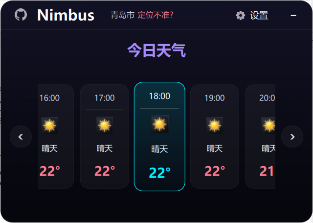
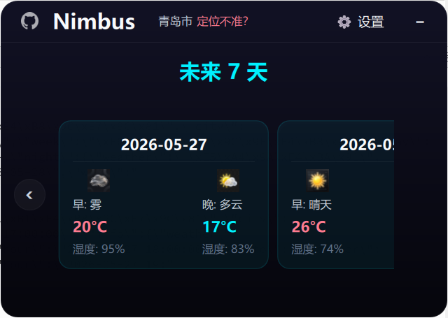
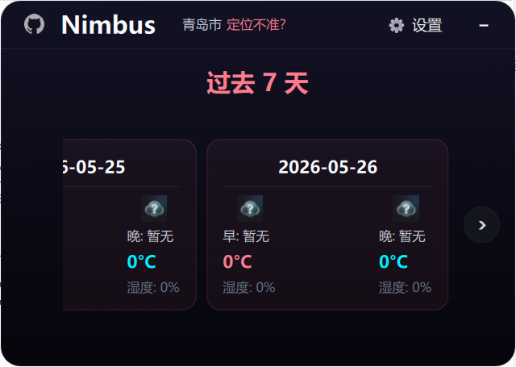
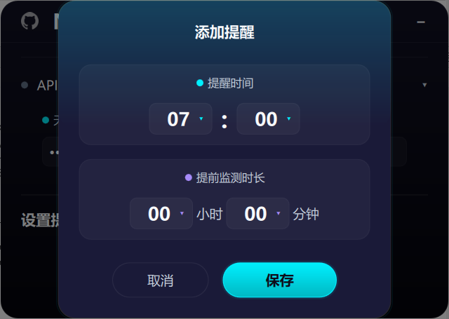
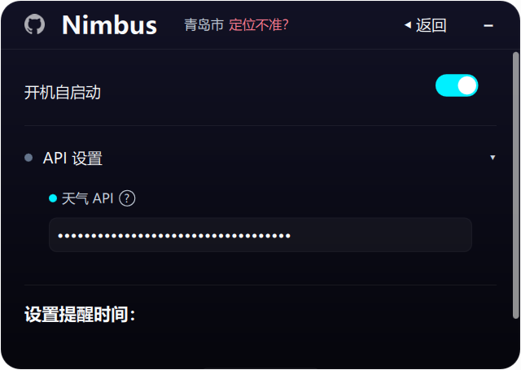
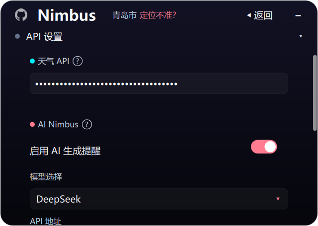
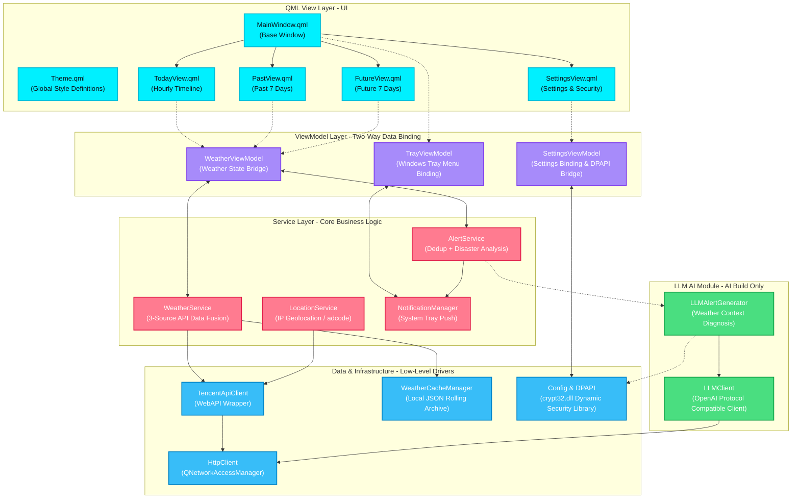

<p align="center">
  
</p>

<h1 align="center" style="font-size: 2.5em; font-weight: bold; margin-bottom: 0.2em; color: #00f0ff;">Nimbus</h1>

<p align="center">
  <strong>Windows Desktop Weather Alert App</strong>
</p>

<p align="center">
  <b>English</b> ·
  <a href="README_zh.md">中文</a> ·
  <a href="README_ja.md">日本語</a>
</p>

<p align="center">
  
  
  
  
  
  
  
  
</p>

<p align="center" style="font-size: 1.1em; color: #cbd5e1; max-width: 750px; margin: 0 auto; line-height: 1.6;">
  Nimbus is a Windows desktop weather app with a dark cyberpunk Glassmorphism UI and LLM-powered intelligent notifications. It runs as a system tray resident, delivering an hourly timeline, flexible multi-point alerts, and a dual-warning system combining official disaster warnings with smart hourly monitoring.
</p>

---

## Screenshots

<table align="center" style="border-collapse: collapse; border: none; width: 100%; max-width: 1000px;">
  <tr style="border: none;">
    <td width="50%" align="center" style="border: none; padding: 12px; vertical-align: top;">
      <div style="border: 1px solid rgba(0,240,255,0.25); border-radius: 12px; padding: 6px; background: rgba(17,17,36,0.5); box-shadow: 0 8px 32px rgba(0,240,255,0.12);">
        
      </div>
      <br/><sub><b>24-Hour Hourly Timeline</b><br/>Current hour highlighted in cyan; future forecasts and historical data scroll horizontally</sub>
    </td>
    <td width="50%" align="center" style="border: none; padding: 12px; vertical-align: top;">
      <div style="border: 1px solid rgba(0,240,255,0.25); border-radius: 12px; padding: 6px; background: rgba(17,17,36,0.5); box-shadow: 0 8px 32px rgba(0,240,255,0.12);">
        
      </div>
      <br/><sub><b>7-Day Weather Outlook</b><br/>Electric cyan glassmorphism cards showing morning/evening temperature, humidity, and wind</sub>
    </td>
  </tr>
  <tr style="border: none;">
    <td width="50%" align="center" style="border: none; padding: 12px; vertical-align: top;">
      <div style="border: 1px solid rgba(255,123,144,0.25); border-radius: 12px; padding: 6px; background: rgba(17,17,36,0.5); box-shadow: 0 8px 32px rgba(255,123,144,0.12);">
        
      </div>
      <br/><sub><b>7-Day Historical Archive</b><br/>Sunset coral warm theme, auto-archived from local hourly rolling cache</sub>
    </td>
    <td width="50%" align="center" style="border: none; padding: 12px; vertical-align: top;">
      <div style="border: 1px solid rgba(0,240,255,0.25); border-radius: 12px; padding: 6px; background: rgba(17,17,36,0.5); box-shadow: 0 8px 32px rgba(0,240,255,0.12);">
        
      </div>
      <br/><sub><b>Scheduled Weather Alerts</b><br/>Custom time points with advance monitoring window; supports edit and delete</sub>
    </td>
  </tr>
  <tr style="border: none;">
    <td width="50%" align="center" style="border: none; padding: 12px; vertical-align: top;">
      <div style="border: 1px solid rgba(255,255,255,0.1); border-radius: 12px; padding: 6px; background: rgba(17,17,36,0.5); box-shadow: 0 8px 32px rgba(255,255,255,0.05);">
        
      </div>
      <br/><sub><b>Standard Edition (Fixed Templates)</b><br/>Built-in Chinese logic alert templates, no additional API cost</sub>
    </td>
    <td width="50%" align="center" style="border: none; padding: 12px; vertical-align: top;">
      <div style="border: 1px solid rgba(50,205,80,0.25); border-radius: 12px; padding: 6px; background: rgba(17,17,36,0.5); box-shadow: 0 8px 32px rgba(50,205,80,0.12);">
        
      </div>
      <br/><sub><b>AI Edition (LLM Natural Language)</b><br/>DeepSeek weather diagnosis with clothing & commute advice; auto fallback to templates when offline</sub>
    </td>
  </tr>
</table>

---

## Core Features

### UI/UX
- **Dark Cyberpunk Style**: Global dark gradient background with three contrasting color schemes — Electric Cyan, Sunset Coral, and Pastel Purple.
- **Glassmorphism Cards**: Frosted glass cards with hover edge-light micro-animations and smooth damped scrolling.
- **Desktop Dock Design**: Window size limited to 1/12 of screen area, positioned above the taskbar notification area, auto-hides on focus loss.

### Weather Observation & History
- **24-Hour Timeline**: Hourly weather scroller for the current day; current hour highlighted and auto-advancing with system time.
- **Future & Past Dual Coverage**: 7-day forecast + 7-day historical weather cards, backed by local JSON hourly rolling cache — works offline.
- **adcode City-Level Positioning**: Auto IP geolocation or manual selection from 98 cities nationwide, normalized to city-level region codes.

### Dual Alert & LLM
- **Tencent Official Disasters + Hourly Smart Monitoring**: Dual alert fusion algorithm eliminates duplicate notifications while predicting rain probability and extreme temperature/humidity.
- **DeepSeek Weather Diagnosis** (AI Edition only): When an alert triggers, DeepSeek generates conversational clothing and commute tips based on real-time data.
- **Fallback Mechanism**: Automatically switches to local standard Chinese template notifications when DeepSeek API is unavailable.

### Security Integration
- **Tray Resident & Auto-Start**: System tray right-click menu, auto-start via Windows Registry `Run` key.
- **Windows DPAPI Encryption**: API keys and LLM tokens encrypted with Windows DPAPI, bound to the current user — config files cannot be decrypted on other devices.
- **WiX MSI Installer**: Custom install path, startup registration, and clean uninstall.
- **Auto Update Check**: Silently checks GitHub Releases on startup; a red dot appears on the toolbar GitHub icon when a new version is available.

---

## Version Comparison & Download

Nimbus uses a single codebase with two conditional compilation branches, producing two independent installers.

| Aspect | Standard Edition | AI Edition |
|:---|:---:|:---:|
| **CMake Build Flag** | `-DWITH_LLM=OFF` | `-DWITH_LLM=ON` |
| **Notification Logic** | Fixed Chinese templates | DeepSeek natural language + offline auto fallback |
| **External API Dependency** | Tencent LBS WebService API only | Tencent LBS API + DeepSeek (OpenAI-compatible) API |
| **Secure Storage** | DPAPI encrypted Tencent dev key | DPAPI dual-key encryption (Tencent key + LLM key) |
| **Package Artifact** | `Nimbus_Standard.msi` | `Nimbus_AI.msi` |
| **Portable Archive** | `Nimbus-v1.0.0-Standard.zip` | `Nimbus-v1.0.0-AI.zip` |

> [!NOTE]
> When the LLM switch is disabled, the AI Edition has the same runtime overhead and underlying dependencies as the Standard Edition.

[Download latest release from GitHub Releases](https://github.com/shimamuraDS/Nimbus/releases)

---

## Technology Stack

```
┌───────────────────────────────────────────────────────┐
│                    QML View Layer                     │
│   MainWindow · TodayView · PastView · FutureView      │
│   SettingsView · 11 Reusable Components (Theme, etc.) │
├───────────────────────────────────────────────────────┤
│                ViewModel Layer (C++)                  │
│   WeatherViewModel · SettingsViewModel · TrayVM       │
├───────────────────────────────────────────────────────┤
│                  Service Layer                        │
│   Weather · Location · Alert · Notification           │
├───────────────────┬───────────────────────────────────┤
│   Network Layer   │        Data / Util Layer          │
│   Tencent LBS API │  Cache Manager · DPAPI · Config   │
│  (3 weather APIs) │  TimeUtil · WeatherCode · Screen  │
├───────────────────┴───────────────────────────────────┤
│               LLM Module (AI build only)              │
│        LLMClient (OpenAI compat) · LLMAlertGenerator  │
└───────────────────────────────────────────────────────┘
```

| Layer | Technology | Description |
|:---|:---|:---|
| **Language** | C++17 · QML (Qt Quick) | Native execution efficiency + GPU-accelerated declarative UI |
| **Core Framework** | Qt 6.8 LTS | Core / Gui / Qml / Quick / Network / Widgets |
| **Build System** | CMake 3.16+ · Ninja | Modern C++ build, Ninja incremental compilation |
| **Design Pattern** | MVVM + 3-Tier Service Architecture | Two-way UI data binding, zero business logic in View |
| **External Services** | Tencent LBS API + OpenAI-compatible network layer | IP geolocation, weather alerts, real-time/hourly/multi-day weather |
| **Encryption** | Windows DPAPI (dynamic loading of crypt32.dll) | No static dependency, compatible across Windows distributions |
| **Packaging** | WiX Toolset v7 | Windows installer standard, supports install/upgrade/uninstall |
| **Testing** | QtTest + CTest | Covers time-window merging, multi-source alert decision, and HTTP async retry |

---

## Architecture



---

## Build Guide

### 1. Prerequisites

* **Qt SDK**: Qt 6.8+ (MinGW 64-bit build kit)
* **CMake**: v3.16 or higher
* **Ninja**: Recommended as CMake generator
* **WiX Toolset**: v7+ (packaging only)

### 2. Build

```bash
git clone https://github.com/shimamuraDS/Nimbus.git
cd Nimbus

# Standard Edition (LLM disabled)
cmake -G "Ninja" -DWITH_LLM=OFF -DCMAKE_BUILD_TYPE=Release -B build-standard
cmake --build build-standard --config Release

# AI Edition (LLM enabled)
cmake -G "Ninja" -DWITH_LLM=ON -DCMAKE_BUILD_TYPE=Release -B build-ai
cmake --build build-ai --config Release
```

### 3. Testing

```bash
ctest --test-dir build-standard --output-on-failure
```

---

## WiX MSI Packaging

### 1. Deploy Qt Runtime

```bash
windeployqt --qmldir ./qml --release deploy/standard/Nimbus.exe
```

### 2. Build MSI

```powershell
# Generate WXS definition file
python scripts/generate_wxs.py deploy/standard scripts/Nimbus_Standard.wxs --name "Nimbus Standard" --upgrade-code "<YOUR_GUID>"

# Add UI extension library
wix extension add WixToolset.UI.wixext

# Compile MSI package
wix build -ext WixToolset.UI.wixext -o scripts/Installer/Nimbus_Standard.msi scripts/Nimbus_Standard.wxs
```

---

## FAQ

> [!WARNING]
> **Missing `crypt32` linker library during compilation?**
> Nimbus uses `LoadLibrary` for dynamic loading. Do not statically link `crypt32` in CMake, as this may cause compatibility issues on older Windows versions.

> [!TIP]
> **How to add more manual location cities?**
> Append city adcode and name mappings in `src/util/WeatherCode.h`, then recompile — the UI city selection menu will update automatically.

> [!CAUTION]
> **LLM returning abnormal weather tips?**
> Ensure the correct API Base URL (e.g. `https://api.deepseek.com`) and a valid API KEY are entered in the settings page. Use the "Test Connection" button in the API settings to verify connectivity.

---

## License

This project is open-sourced under the [MIT License](LICENSE).

---

<p align="center">
  by <b>shimamuraDS</b>
</p>
