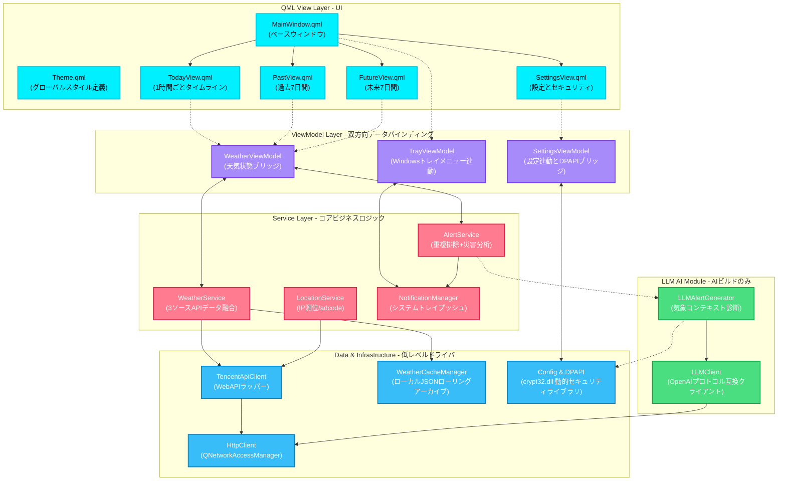

<p align="center">
  
</p>

<h1 align="center" style="font-size: 2.5em; font-weight: bold; margin-bottom: 0.2em; color: #00f0ff;">Nimbus</h1>

<p align="center">
  <strong>Windows デスクトップ天気アラートアプリ</strong>
</p>

<p align="center">
  <a href="README.md">English</a> ·
  <a href="README_zh.md">中文</a> ·
  <b>日本語</b>
</p>

<p align="center">
  
  
  
  
  
  
  
  
</p>

<p align="center" style="font-size: 1.1em; color: #cbd5e1; max-width: 750px; margin: 0 auto; line-height: 1.6;">
  Nimbusは、ダークサイバーパンクなGlassmorphism UIとLLM搭載のインテリジェント通知を特徴とするWindowsデスクトップ天気アプリです。システムトレイ常駐型で動作し、1時間ごとのタイムライン、柔軟なマルチポイントアラート、公式災害警報とスマートな時間別モニタリングを組み合わせたデュアル警告システムを提供します。
</p>

---

## スクリーンショット

<table align="center" style="border-collapse: collapse; border: none; width: 100%; max-width: 1000px;">
  <tr style="border: none;">
    <td width="50%" align="center" style="border: none; padding: 12px; vertical-align: top;">
      <div style="border: 1px solid rgba(0,240,255,0.25); border-radius: 12px; padding: 6px; background: rgba(17,17,36,0.5); box-shadow: 0 8px 32px rgba(0,240,255,0.12);">
        
      </div>
      <br/><sub><b>24時間の1時間ごとタイムライン</b><br/>現在時刻をシアンでハイライト、未来予測と過去データを横スクロール</sub>
    </td>
    <td width="50%" align="center" style="border: none; padding: 12px; vertical-align: top;">
      <div style="border: 1px solid rgba(0,240,255,0.25); border-radius: 12px; padding: 6px; background: rgba(17,17,36,0.5); box-shadow: 0 8px 32px rgba(0,240,255,0.12);">
        
      </div>
      <br/><sub><b>7日間の天気予報</b><br/>エレクトリックシアンのGlassmorphismカードで朝夕の温湿度と風力を表示</sub>
    </td>
  </tr>
  <tr style="border: none;">
    <td width="50%" align="center" style="border: none; padding: 12px; vertical-align: top;">
      <div style="border: 1px solid rgba(255,123,144,0.25); border-radius: 12px; padding: 6px; background: rgba(17,17,36,0.5); box-shadow: 0 8px 32px rgba(255,123,144,0.12);">
        
      </div>
      <br/><sub><b>過去7日間の自動アーカイブ</b><br/>サンセットコーラルの暖色テーマ、ローカルの1時間ごとキャッシュから自動归档</sub>
    </td>
    <td width="50%" align="center" style="border: none; padding: 12px; vertical-align: top;">
      <div style="border: 1px solid rgba(0,240,255,0.25); border-radius: 12px; padding: 6px; background: rgba(17,17,36,0.5); box-shadow: 0 8px 32px rgba(0,240,255,0.12);">
        
      </div>
      <br/><sub><b>定時天気モニタリングアラート</b><br/>カスタム時間ポイントと事前モニタリング時間、編集・削除に対応</sub>
    </td>
  </tr>
  <tr style="border: none;">
    <td width="50%" align="center" style="border: none; padding: 12px; vertical-align: top;">
      <div style="border: 1px solid rgba(255,255,255,0.1); border-radius: 12px; padding: 6px; background: rgba(17,17,36,0.5); box-shadow: 0 8px 32px rgba(255,255,255,0.05);">
        
      </div>
      <br/><sub><b>標準版（固定テンプレート通知）</b><br/>組み込みの中国語ロジックアラートテンプレート、追加APIコストなし</sub>
    </td>
    <td width="50%" align="center" style="border: none; padding: 12px; vertical-align: top;">
      <div style="border: 1px solid rgba(50,205,80,0.25); border-radius: 12px; padding: 6px; background: rgba(17,17,36,0.5); box-shadow: 0 8px 32px rgba(50,205,80,0.12);">
        
      </div>
      <br/><sub><b>AI版（LLM自然言語通知）</b><br/>DeepSeek気象診断と服装・通勤アドバイス、オフライン時に自動テンプレートフォールバック</sub>
    </td>
  </tr>
</table>

---

## 主な機能

### UI/UX
- **ダークサイバーパンクスタイル**: グローバルダークグラデーション背景に、エレクトリックシアン、サンセットコーラル、パステルパープルの3つのコントラストカラースキーム。
- **Glassmorphismカード**: すりガラス効果のカード、ホバー時のエッジライトマイクロアニメーションとスムーズな減衰スクロール。
- **デスクトップドックデザイン**: ウィンドウサイズを画面の1/12に制限、タスクバー通知領域の上に配置し、フォーカス喪失時に自動非表示。

### 気象観測と履歴
- **24時間タイムライン**: 当日の1時間ごとの天気を水平スクロール、現在時刻をハイライトしシステム時間に合わせて自動スライド。
- **未来と過去のデュアルカバレッジ**: 7日間予報 + 過去7日間の天気カード、ローカルJSONの1時間ごとローリングキャッシュに基づく — オフラインでも利用可能。
- **adcode都市レベル測位**: IP自動位置特定、または全国98都市からの手動選択、市区町村コードに正規化。

### デュアルアラートとLLM
- **Tencent公式災害 + 1時間ごとスマート監視**: デュアルアラート融合アルゴリズムにより重複通知を排除し、降雨確率と極端な温湿度を予測。
- **DeepSeek気象診断**（AI版のみ）: アラート発生時、DeepSeekがリアルタイムデータに基づいて会話的な服装と通勤のヒントを生成。
- **フォールバックメカニズム**: DeepSeek APIが利用できない場合、自動的にローカルの標準中国語テンプレート通知に切り替え。

### セキュリティ統合
- **トレイ常駐と自動起動**: システムトレイ右クリックメニュー、Windowsレジストリ`Run`キーによる自動起動。
- **Windows DPAPI暗号化**: APIキーとLLMトークンをWindows DPAPIで暗号化、現在のユーザーにバインド — 設定ファイルは他のデバイスで復号化できません。
- **WiX MSIインストーラー**: カスタムインストールパス、スタートアップ登録、クリーンアンインストール。
- **自動アップデートチェック**: 起動時にGitHub Releasesを静かに確認し、新しいバージョンがある場合、ツールバーのGitHubアイコンに赤いドットが表示されます。

---

## バージョン比較とダウンロード

Nimbusは単一コードベース、デュアルコンパイル条件分岐方式を採用し、2つの独立したインストーラーを生成します。

| 項目 | Standard 標準版 | AI 智能版 |
|:---|:---:|:---:|
| **CMakeビルドフラグ** | `-DWITH_LLM=OFF` | `-DWITH_LLM=ON` |
| **通知ロジック** | 固定中国語テンプレート | DeepSeek自然言語 + APIオフライン時自動テンプレートフォールバック |
| **外部API依存** | Tencent LBS WebService APIのみ | Tencent LBS API + DeepSeek (OpenAI互換) API |
| **セキュアストレージ** | DPAPI暗号化Tencent開発キー | DPAPIデュアルキー暗号化（Tencentキー + LLMキー） |
| **パッケージ成果物** | `Nimbus_Standard.msi` | `Nimbus_AI.msi` |
| **ポータブルアーカイブ** | `Nimbus-v1.0.0-Standard.zip` | `Nimbus-v1.0.0-AI.zip` |

> [!NOTE]
> AI版はLLMスイッチが無効の場合、実行時オーバーヘッドと基盤依存関係は標準版と同じです。

[GitHub Releasesで最新バージョンをダウンロード](https://github.com/shimamuraDS/Nimbus/releases)

---

## 技術スタック

```
┌───────────────────────────────────────────────────────┐
│                    QML View Layer                     │
│   MainWindow · TodayView · PastView · FutureView      │
│   SettingsView · 11の再利用可能コンポーネント          │
├───────────────────────────────────────────────────────┤
│                ViewModel Layer (C++)                  │
│   WeatherViewModel · SettingsViewModel · TrayVM       │
├───────────────────────────────────────────────────────┤
│                  Service Layer                        │
│   Weather · Location · Alert · Notification           │
├───────────────────┬───────────────────────────────────┤
│   Network Layer   │        Data / Util Layer          │
│   Tencent LBS API │  Cache Manager · DPAPI · Config   │
│  (3 weather APIs) │  TimeUtil · WeatherCode · Screen  │
├───────────────────┴───────────────────────────────────┤
│               LLM Module (AI build only)              │
│        LLMClient (OpenAI compat) · LLMAlertGenerator  │
└───────────────────────────────────────────────────────┘
```

| レイヤー | 技術 | 説明 |
|:---|:---|:---|
| **開発言語** | C++17 · QML (Qt Quick) | ネイティブ実行効率 + GPU加速宣言型UI |
| **コアフレームワーク** | Qt 6.8 LTS | Core / Gui / Qml / Quick / Network / Widgets |
| **ビルドシステム** | CMake 3.16+ · Ninja | モダンC++ビルド、Ninjaインクリメンタルコンパイル |
| **デザインパターン** | MVVM + 3層サービスアーキテクチャ | UI双方向データバインディング、Viewにビジネスロジックなし |
| **外部サービス** | Tencent LBS API + OpenAI互換ネットワーク層 | IP測位、天気警報、リアルタイム/毎時/複数日天気 |
| **暗号化** | Windows DPAPI (crypt32.dll動的ロード) | 静的依存なし、Windowsディストリビューション間互換 |
| **パッケージング** | WiX Toolset v7 | Windowsインストーラー標準、インストール/アップグレード/アンインストール対応 |
| **テスト** | QtTest + CTest | 時間枠マージ、マルチソースアラート判定、HTTP非同期リトライをカバー |

---

## アーキテクチャ



---

## ビルドガイド

### 1. 前提条件

* **Qt SDK**: Qt 6.8+ (MinGW 64-bitビルドキット)
* **CMake**: v3.16以上
* **Ninja**: CMakeジェネレーターとして推奨
* **WiX Toolset**: v7+（パッケージングのみ）

### 2. ビルド

```bash
git clone https://github.com/shimamuraDS/Nimbus.git
cd Nimbus

# 標準版 (LLM無効)
cmake -G "Ninja" -DWITH_LLM=OFF -DCMAKE_BUILD_TYPE=Release -B build-standard
cmake --build build-standard --config Release

# AI版 (LLM有効)
cmake -G "Ninja" -DWITH_LLM=ON -DCMAKE_BUILD_TYPE=Release -B build-ai
cmake --build build-ai --config Release
```

### 3. テスト

```bash
ctest --test-dir build-standard --output-on-failure
```

---

## WiX MSIパッケージング

### 1. Qtランタイムの配置

```bash
windeployqt --qmldir ./qml --release deploy/standard/Nimbus.exe
```

### 2. MSIのビルド

```powershell
# WXS定義ファイルの生成
python scripts/generate_wxs.py deploy/standard scripts/Nimbus_Standard.wxs --name "Nimbus Standard" --upgrade-code "<YOUR_GUID>"

# UI拡張ライブラリの追加
wix extension add WixToolset.UI.wixext

# MSIパッケージのコンパイル
wix build -ext WixToolset.UI.wixext -o scripts/Installer/Nimbus_Standard.msi scripts/Nimbus_Standard.wxs
```

---

## よくある質問

> [!WARNING]
> **コンパイル時に`crypt32`リンカーライブラリが見つかりませんか？**
> Nimbusは`LoadLibrary`による動的ロードを採用しています。CMakeで`crypt32`を静的にリンクしないでください。古いバージョンのWindowsで互換性の問題が発生する可能性があります。

> [!TIP]
> **手動で位置都市を追加する方法は？**
> `src/util/WeatherCode.h`に都市のadcodeと名前のマッピングを追加し、再コンパイルすると、UIの都市選択メニューが自動的に更新されます。

> [!CAUTION]
> **LLMが異常な天気ヒントを返しますか？**
> 設定ページで正しいAPI Base URL（例：`https://api.deepseek.com`）と有効なAPI KEYが入力されていることを確認してください。API設定画面の「接続テスト」ボタンで接続状態を確認できます。

---

## ライセンス

本プロジェクトは[MITライセンス](LICENSE)の下でオープンソース公開されています。

---

<p align="center">
  by <b>shimamuraDS</b>
</p>
